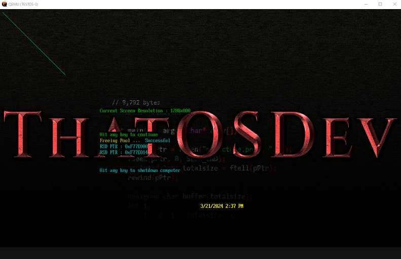

# LOS-EFI
# **LCARS - Library Computer Access Retrieval System**  
  
LCARS is based on the idea from the TV show Star Trek - Next Generation. Those panels you see on the bridge of the enterprise are known as LCARS displays. Others have attempted to make this, but they made a shell over windows or Linux. Mine is *FROM SCRATCH*, thus not using a linux kernel or anything related to MS Windows.  
  
*NOTE : I make NO MONEY on this project. YES, I'm talking to you CBS ! So you can't sue me or force a take down !*  
  
  
# BIG THANK YOU TO THE FOLLOWING PEOPLE WHO HELPED ME TO MAKE THIS OS POSSIBLE
	- ANGEL  
	- QUESO  
	- JESTERJUNK  
	- STRYKER  
	- AND ALL OF MY YOUTUBE SUBSCRIBERS  
  

  
This Operating System is in development using the EFI as the boot loader.  
  
Using GCC 13.2 from this link.  
https://nuwen.net/mingw.html  
  
*NOTE* : Do to the folks who like to cause problems for other youtubers, I am showing my OFFICIAL youtube channel here. Do NOT trust the scammers who pretend to be me !  
https://www.youtube.com/@ThatOSDev/videos  
  
  
The blow list is for EFI environment at this time. Kernel dev will have some of this done already implemented by the time I show the actual kernel LCARS GUI world.  
# ** IMPLEMENTED **  

	* EFI Text
	* EFI Keyboard
	* EFI Graphics (GOP)
	* EFI Rectangle and Line Drawing
	* EFI Display Screen Resolutions
	* EFI Based BMP Image Loading - Displays my own Wallpaper now
	* EFI RSDP
	* EFI TPL Timing
	* EFI Delay - Microseconds
	* EFI Based PRINTF with Variadic Functions

# ** CURRENT TASKS TO ADD**  

	* Mouse & Gesture ( Touch Screen ) support
	* FONTS !!!!!!!!
	* MMap
	* Kernal Dev
	* Reading Raw Sectors from Drive  
	* Writing Raw Sectors to Drive  
	* Format and Partition drive with the EFI Environment  
	* Operating System Installation with just the EFI Environment  
	* Text Editor  
	* Assembler  
	* Networking  
	* Blutooth  
	* Simple Web Browser  
	* Getting some sort of C compiler into the OS  

  
