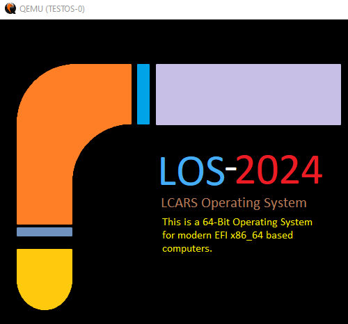

# LOS-EFI
# **LCARS - Library Computer Access Retrieval System**  
  
LCARS is based on the idea from the TV show Star Trek - Next Generation. Those panels you see on the bridge of the enterprise are known as LCARS displays. Others have attempted to make this, but they made a shell over windows or Linux. Mine is *FROM SCRATCH*, thus not using a linux kernel or anything related to MS Windows.  
  
*NOTE : I make NO MONEY on this project. YES, I'm talking to you CBS ! So you can't sue me or force a take down !*  
  
  
# BIG THANK YOU TO THE FOLLOWING PEOPLE WHO HELPED ME TO MAKE THIS OS POSSIBLE
	- ANGEL  
	- QUESO  
	- JESTERJUNK  
	- STRYKER  
	- AND ALL OF MY YOUTUBE SUBSCRIBERS  
  
This Operating System is in development using the EFI as the boot loader.  
  
*UPDATED : I had to revert back to GCC 11.2 from that link. GCC 13.2 has a bug that would not allow me to compile correctly. The bug is from the binutils 2.40+ error that has been known for years. But I guess nuwen wasn't aware of this. I did email him, but he replied that he is too busy to fix it. I put a copy of 11.2 into the HOLD folder. Although Github complains about it's size, it should stay put. Grab a copy while it's still here.*  
https://github.com/ThatOSDev/LOS-EFI/tree/master/hold  
~~Using GCC 13.2 from this link.~~  
~~https://nuwen.net/mingw.html~~  
  
*OSFMount*  
https://www.osforensics.com/tools/mount-disk-images.html  
  
*QEMU*  
https://www.qemu.org/  
  
*NOTE 1* : All three of the above programs are in my windows path. You can do a search on how to do that.  
  
*NOTE 2* : Do to the folks who like to cause problems for other youtubers, I am showing my OFFICIAL youtube channel here. Do NOT trust the scammers who pretend to be me !  
https://www.youtube.com/@ThatOSDev/videos  
  
  
# ** IMPLEMENTED EFI **  

	* EFI Text
	* EFI Keyboard
	* EFI Graphics (GOP)
	* EFI Rectangle and Line Drawing
	* EFI Display Screen Resolutions
	* EFI Based BMP Image Loading - Displays my own Wallpaper now
	* EFI RSDP
	* EFI TPL Timing
	* EFI Delay - Microseconds
	* EFI Based PRINTF with Variadic Functions
	* EFI File Loading and executing  
  
# ** IMPLEMENTED LOADER / KERNEL **  

	* Basic Graphics  
	* A Basic home-brew FONT so I can test with. (I want to eventually load a TTF.)  
	* A Basic Print. (NOTE : I will be updating this later to printf using Variadic Functions.)
  
# ** TO BE ADDED **  

	* GDT Code  
	* MMap  
	* Paging  
	* Mouse & Gesture ( Touch Screen ) support
	* FNT - Bitmap Font File
	* TTF - True Type Font
	* Reading Raw Sectors from Drive  
	* Writing Raw Sectors to Drive  
	* Format and Partition drive with the EFI Environment  
	* Operating System Installation with just the EFI Environment  
	* Text Editor  
	* Assembler  
	* Networking  
	* Blutooth  
	* Simple Web Browser  
	* Getting some sort of C compiler into the OS  

  
 
